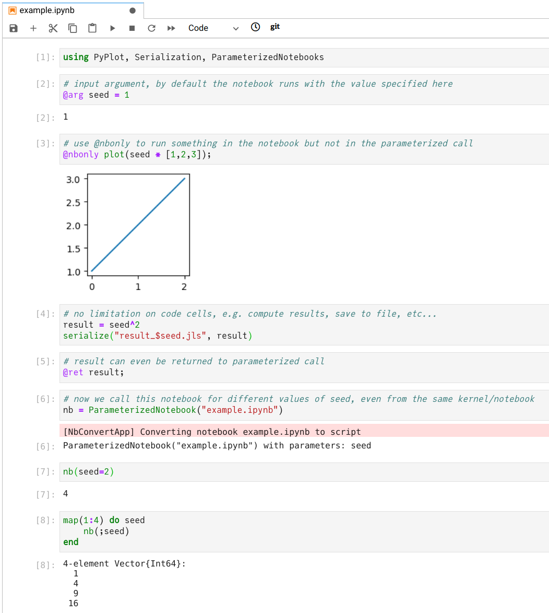

# ParameterizedNotebooks

[](https://github.com/marius311/ParameterizedNotebooks.jl/actions/workflows/runtests.yml)

Turn a Jupyter notebook or specific sections within a Jupyter notebook into a general purpose Julia function which can be run repeatedly from the same or other Julia sessions with different input arguments.

## Install

Requires Julia 1.6 or above. From the Julia package prompt:

```
pkg> add ParameterizedNotebooks
```

## Usage

Best demonstrated with an example:



There are no limitations on what the notebook contains or how complex it is, only that the arguments which will be parameterized over are marked with `@nbparam name = val`. The `@nbparam` macro does nothing special when running the notebook normally in Jupyter, so above `seed` is set to `1` and execution proceeds as usual. 

You can mark code which should only run in Jupyter but will otherwise be skipped in the parameterized call (e.g. visualization) with `@nbonly`. 

You can return a value from the notebook with the `@nbreturn` macro. `@nbreturn` is also useful to return the parameterized call somewhere before the end of your notebook. Code cells below this are not run and can contain other code, even triggering the parameterized call itself from the same kernel/notebook, as in the above example. 

## Advanced

You can also select only certain sections from the notebook to run with the keyword argument `sections`. Sections should be delineated in the notebook with typical markdown headings. For example:

```julia
ParameterizedNotebook("mynotebook.ipynb", sections=("Initialization", "Compute result"))
```

will run all code in the sections "Initialization" and "Compute result" and all of their subsections. If recursing into the subsections is undesired, also pass `recursive=false`. The `sections` argument should be a string matching a heading title exactly or a regex which matches a heading title, or a tuple of strings/regexs for matching multiple sections. 

When `sections` is provided, printing the `ParameterizedNotebook` shows a tree which can be used to verify the expected code will be run, e.g. you might see something like this:

```julia
julia> ParameterizedNotebook("mynotebook.ipynb", sections=("Init", "Section B"), recursive=false)

ParameterizedNotebook("mynotebook.ipynb") with parameters: (param1, param2)
□ ~
  ☒ Init
    ☒ …
  □ Section A
    □ Subsection A
  ☒ Section B
    ☒ …
    □ Subsection B
```

## Details

The package is extremely simple and just reads the notebook file from disk and repeatedly `eval`'s the selected cell into `Main` (just as if you had run the cells in Jupyter), replacing `@nbparam` expressions with the appropriate value, skipping `@nbonly` expressions, and returning if it hits a `@nbreturn`.

## Related

Similar to [takluyver/nbparameterise](https://github.com/takluyver/nbparameterise), [tritemio/nbrun](https://github.com/tritemio/nbrun), and [nteract/papermill](https://github.com/nteract/papermill), but more powerful because arbitrary objects, not just string representations, can be passed as parameters and returned from the notebooks. Also, much simpler to use and only requires decorating a few lines with macros. However, lacks the ability to generate "reports" with outputs filled in. Also similar to [stevengj/NBInclude.jl](https://github.com/stevengj/NBInclude.jl) which I discovered after making this, which has some nice orthogonal features, but doesn't let you parameterize.
