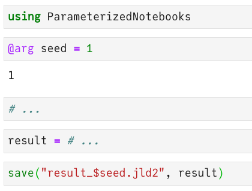

# ParameterizedNotebooks

Turn a Jupyter notebook into a Julia function, which you can run repeatedly from other Julia sessions with different input arguments. 

## Install

Needs [nbconvert](https://nbconvert.readthedocs.io/en/latest/install.html):
```
pip install nbconvert
```

Then from the Julia package prompt:

```
pkg> add https://github.com/marius311/ParameterizedNotebooks.jl.git
```


## Usage

The idea is you have some notebook that structurally looks like:



There are no limitations whatsoever on what the notebook contains or how complex it is, only that the arguments which will be parameterized over are marked with `@arg name = val`. The `@arg` macro does nothing special when running the notebook normally in Jupyter, so above `seed` is set to `1` and execution proceeds as usual. 

With the above notebook saved into a file `MyNotebook.jl`, you can now load it from a separate Julia session (REPL, another notebook, etc...):

```julia
julia> using ParameterizedNotebooks

julia> pn = ParameterizedNotebook("MyNotebook.ipynb")
[NbConvertApp] Converting notebook MyNotebook.ipynb to script
ParameterizedNotebook("MyNotebook.ipynb") with parameters: (seed)
```

Now to run the notebook for different values of `seed`, simply call:
```julia
pn(seed=2)
```
or to loop over different values:
```julia
for seed = 1:100
    pn(;seed)
end
```
etc...

Any number of `@arg` arguments anywhere in the notebook are allowed. Finally, a special macro `@skip` will execute code in Jupyter but be skipped when running with ParameterizedNotebooks, and `@skiprest` skips the entire rest of the notebook.