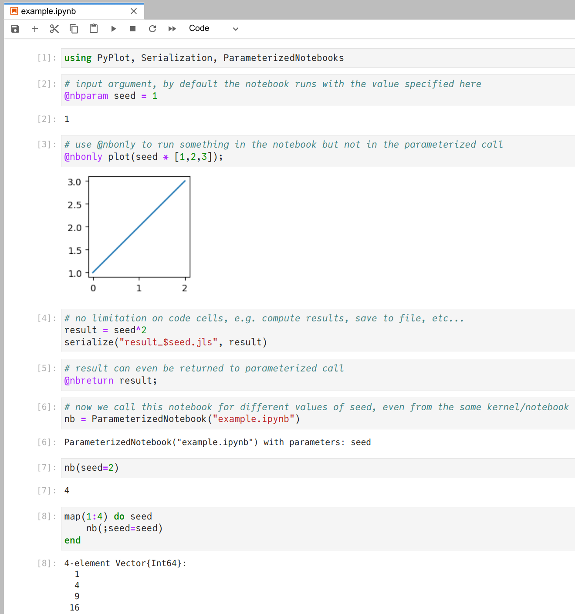

# ParameterizedNotebooks

[](https://github.com/marius311/ParameterizedNotebooks.jl/actions/workflows/runtests.yml)

Turn a Jupyter notebook into general purpose Julia function which can be run repeatedly from the same or other Julia sessions with different input arguments.

## Install

Needs [nbconvert](https://nbconvert.readthedocs.io/en/latest/install.html):
```
pip install nbconvert
```

Then from the Julia package prompt:

```
pkg> add https://github.com/marius311/ParameterizedNotebooks.jl.git
```


## Usage

Best demonstrated with an example:



There are no limitations whatsoever on what the notebook contains or how complex it is, only that the arguments which will be parameterized over are marked with `@arg name = val`. The `@arg` macro does nothing special when running the notebook normally in Jupyter, so above `seed` is set to `1` and execution proceeds as usual. 

You can mark code which should only run in Jupyter but will otherwise be skipped in the parameterized call (e.g. visualization) with `@nbonly`. 

You can return a value from the notebook with the `@ret` macro. `@ret` is also useful to return the parameterized call somewhere before the end of your notebook. Code cells below this are not run and can contain other code, even triggering the parameterized call itself from the same kernel/notebook, as in the above example. 

## Details

The package is extremely simple and just reads the notebook file from disk and repeatedly `eval`'s each cell into `Main` (just as if you had run the cells, thus avoiding any scoping issues), replacing `@arg` expressions with the appropriate value, skipping `@nbonly` expressions, and returning once it hits a `@ret`.

## Related

Similar to [takluyver/nbparameterise](https://github.com/takluyver/nbparameterise), [tritemio/nbrun](https://github.com/tritemio/nbrun), and [nteract/papermill](https://github.com/nteract/papermill), but more powerful because arbitrary objects, not just string representations, can be passed as parameters and returned from the notebooks. Also, much simpler to use and only requires decorating a few lines with macros. However, lacks the ability to generate "reports" with outputs filled in. 
